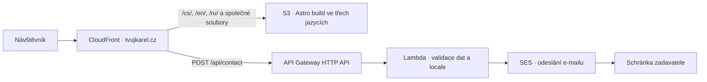

# TvujKarel.cz — zadání webu pro programátora

Verze: 1.4\
Datum: 9. 10. 2026\
Jazyky webu: čeština (`cs`), angličtina (`en`), ruština (`ru`); výchozí jazyk čeština.\
Zadavatel a poskytovatel služby: Lukáš Niedoba, IČO 06838103

## 1. Cíl projektu

Vytvořit rychlý, přehledný a přátelský web značky **Tvůj Karel** pro pomoc s počítači a technikou přímo u zákazníka v Praze. Cílovou skupinou jsou domácnosti a malé kanceláře, které potřebují konkrétní problém vyřešit a nechtějí studovat technické návody.

Návštěvník má během 20 sekund pochopit službu, najít cenu a zavolat nebo napsat. Primární konverze je telefonát; sekundární je zpráva nebo odeslání poptávkového formuláře.

MVP: jedna hlavní stránka, stránka ochrany osobních údajů, funkční kontaktní formulář a základní SEO, **vše v češtině, angličtině a ruštině již v první verzi**. Bez zákaznických účtů, plateb, rezervací a administrace.

## 2. Značka a komunikace

- Doména: `tvujkarel.cz`; vlastnictví a dostupnost nejsou tímto dokumentem ověřeny.
- Zobrazovaný název: **Tvůj Karel**.
- Claim: **Když technika neposlouchá.**
- Hlavní vysvětlení služby: **Pomoc s počítačem a technikou přímo u vás v Praze.**
- Tón: lidský, klidný, srozumitelný; zákazníkovi vykat.
- Veřejné texty stavět na značce **Tvůj Karel** a přínosu služby, bez osobního medailonku zadavatele. Používat neutrální formulace nebo název značky; nevyvolávat dojem call centra či týmu techniků.
- Karel je název značky, nikoli fiktivní osoba. Skutečný poskytovatel Lukáš Niedoba zůstává uvedený v identifikačních údajích v patičce a na stránce ochrany osobních údajů; nepoužívat jeho jméno jako hlavní marketingové sdělení.
- Neslibovat garantované vyřešení každého problému, okamžitý příjezd ani nepřetržitou dostupnost.

### 2.1 Jazyky a překlady

- Čeština je výchozí jazyk a zdrojová verze textů v tomto zadání. Při implementaci dodat plnohodnotnou anglickou a ruskou verzi všech veřejných textů: navigace, služeb, postupu, ceníku a podmínek, sekce o značce, FAQ, kontaktu, patičky a ochrany osobních údajů.
- Lokalizovat také pole a instrukce formuláře, validační a chybové hlášky, potvrzení odeslání, přístupné názvy ovládacích prvků, alternativní texty obrázků, stránku 404 a SEO metadata. Jazykové varianty mají stejný obsahový a funkční rozsah.
- Název značky **Tvůj Karel**, skutečná identita poskytovatele, kontakty, služby a číselné hodnoty cen zůstávají společné. Ceny ve všech jazycích uvádět v CZK/Kč; lokalizovat jejich formát a vysvětlení DPH, výjezdu a účtování. Lokalita služby zůstává Praha.
- Překlady ukládat do repozitáře, bez automatického překládání za běhu. Před spuštěním ověřit jejich úplnost a významovou shodu, zejména u cen a podmínek. Chybějící překlady musí zablokovat produkční build.

## 3. Rozsah služeb

| Oblast | Nabízený obsah |
| --- | --- |
| Počítače a notebooky | Nastavení nového PC, instalace a nastavení Windows a programů, aktualizace, uživatelské účty, řešení pomalého systému a softwarových problémů. |
| Wi-Fi a internet | Nastavení routeru, připojení zařízení, diagnostika slabého signálu, konfigurace mesh sítě. |
| Tiskárny a příslušenství | Instalace tiskárny, Wi-Fi tisk, skenování, připojení monitorů, webkamer a externích disků. |
| Data a zálohy | Přenos dostupných dat do nového počítače, automatické zálohování, OneDrive, Google Drive a organizace dokumentů. |
| E-mail a účty | Gmail, Outlook, synchronizace, nastavení účtů a zabezpečení. |
| Bezpečnost | Kontrola podezřelého chování, běžný malware, rozšíření prohlížeče, aktualizace a pomoc s rozpoznáním podvodných zpráv. |

Apple/macOS/iCloud a další chytrá zařízení přidat do veřejného obsahu pouze po potvrzení rozsahu zadavatelem. Implementace má umožnit zapnout tyto služby konfigurací.

**Fyzické opravy hardwaru se nenabízejí.** Neprezentovat pájení, výměny součástek, opravy mobilů ani profesionální obnovu dat z poškozených disků. V FAQ stručně vysvětlit, že při podezření na závadu hardwaru lze doporučit specializovaný servis.

## 4. Ceník a účtování

Ceny včetně DPH zobrazovat jako hlavní, dobře viditelné hodnoty. Ceny bez DPH uvést doplňkově. Výpočty vycházejí z dohodnuté sazby DPH 21 %.

| Položka | Včetně DPH | Bez DPH | Podmínky |
| --- | ---: | ---: | --- |
| Práce na místě | 1 452 Kč/h | 1 200 Kč/h | Účtování po započatých půlhodinách. |
| Výjezd v městské části Praha 6 | 390 Kč | 322,31 Kč | Jednorázově za návštěvu. |
| Výjezd do ostatních částí Prahy | 690 Kč | 570,25 Kč | Jednorázově za návštěvu. |

Pod ceníkem uvést: **Účtování po každé započaté půlhodině. Minimální cena práce je 726 Kč včetně DPH (600 Kč bez DPH).**

Ceny bez DPH u paušálů za výjezd jsou zaokrouhlené na dvě desetinná místa.

### Pravidla pro MVP

1. Pro všechny návštěvy platí stejné účtování: minimálně 30 minut, dále každá započatá půlhodina za 726 Kč včetně DPH. Překročením 30 minut začíná druhý účtovaný interval, překročením 60 minut třetí atd.
2. Čas práce se počítá na místě; doprava se nepočítá do doby zásahu.
3. Paušál za výjezd se určí podle městské části adresy zákazníka: Praha 6 za 390 Kč, ostatní části Prahy za 690 Kč včetně DPH. Rozhoduje městská část, nikoli PSČ nebo poštovní označení adresy.
4. Výjezd se účtuje jednou za návštěvu a zahrnuje cestu tam i zpět a běžné parkování.
5. Před návštěvou zákazník zná orientační rozsah práce, způsob účtování a cenu výjezdu. Případné další náklady se odsouhlasí předem.
6. Cenu potřebných licencí či zařízení uvádět odděleně; nákup pouze po domluvě.

Příklady účtování; všechny částky včetně DPH:

| Doba práce | Cena práce | Celkem s výjezdem v Praze 6 | Celkem s výjezdem v ostatní Praze |
| --- | ---: | ---: | ---: |
| Do 30 minut | 726 Kč | 1 116 Kč | 1 416 Kč |
| Nad 30 až do 60 minut | 1 452 Kč | 1 842 Kč | 2 142 Kč |
| Nad 60 až do 90 minut | 2 178 Kč | 2 568 Kč | 2 868 Kč |

Ve veřejném ceníku prezentovat jednu hodinovou sazbu práce a dva paušály za výjezd. Půlhodinové účtování vysvětlit poznámkou pod ceníkem; nevytvářet samostatné tarify pro krátký a běžný zásah ani samostatné řádky pro první a další půlhodinu. Minimální cenu práce vždy uvádět s informací o samostatně účtovaném výjezdu.

## 5. Struktura a obsah hlavní stránky

Pořadí sekcí: hlavička → úvod → o značce → služby → postup → ceník → FAQ → kontakt → patička.

Níže uvedené texty jsou českou zdrojovou verzí. V angličtině a ruštině zachovat stejné pořadí sekcí, význam a konverzní cíle podle oddílu 2.1.

### 5.1 Hlavička

Textové logo Tvůj Karel, kotvy Služby / Jak to funguje / Ceník / O značce / Kontakt a výrazné tlačítko Zavolat. Na mobilu jednoduché přístupné menu.

V hlavičce všech stránek přístupný přepínač **Čeština / English / Русский**, dostupný i na mobilu. Použít běžné odkazy na odpovídající stránku v jiném jazyce a označit aktuální jazyk; nepoužívat samotné vlajky. Přepnutí zachová typ stránky a u hlavní stránky také kotvu sekce, pokud je přítomná. Navigace a odkaz na soukromí vždy vedou na variantu v aktuálním jazyce.

### 5.2 Úvod

Nadpis H1: **Pomoc s počítačem a technikou přímo u vás v Praze**

Claim: **Když technika neposlouchá.**

Text:

> Nefunguje Wi-Fi, tiskárna nebo potřebujete nastavit nový notebook? Tvůj Karel pomůže s technikou u vás doma i v kanceláři. Srozumitelně a bez zbytečných starostí.

Primární tlačítko: **Zavolat**. Sekundární: **Popsat problém**, odkaz na formulář.

V úvodu nezobrazovat hodinovou sazbu, minimální cenu práce, paušály za výjezd ani údaje o DPH a účtování. Číselné ceny a podmínky patří do sekce **Ceník** podle oddílu 5.5; z hlavičky musí být snadno dostupná.

Doplňkové body: Praha / Domácnosti i malé firmy / Srozumitelná cena před návštěvou.

### 5.3 S čím pomůže Tvůj Karel

Šest karet podle tabulky služeb. Každá obsahuje jednoduchou ikonu, název a nejvýše dvě krátké věty. Využít konkrétní problémy zákazníků, například „Tiskárna se nepřipojí k Wi-Fi“ nebo „Potřebuji přesunout fotografie do nového počítače“.

### 5.4 Jak to funguje

1. **Popíšete problém.** Zavoláte nebo napíšete, co nefunguje a kde v Praze jste.
2. **Domluvená návštěva.** Před návštěvou znáte termín, orientační rozsah práce, způsob účtování a cenu výjezdu podle adresy.
3. **Pomoc na místě.** Prověření problému, domluvené nastavení a srozumitelné vysvětlení dalšího postupu.

### 5.5 Ceník

Při implementaci použít kotvu `#cenik` pro odkazy z hlavičky a FAQ.

Zobrazit tabulku z oddílu 4 s jednou hodinovou sazbou práce a dvěma paušály za výjezd. Pod ní uvést poznámku o účtování každé započaté půlhodiny a minimální ceně práce. Ceny bez DPH zobrazovat doplňkově.

Přidat jednoduchý příklad:

> Návštěva na Praze 6 do 30 minut stojí celkem **1 116 Kč**, do hodiny **1 842 Kč**, včetně výjezdu a DPH.

Tlačítko **Domluvit návštěvu** vede na kontakt. Neuvádět pevnou konečnou cenu složitějšího zásahu bez znalosti rozsahu.

### 5.6 O značce

Krátký blok bez osobního medailonku, umístěný hned po úvodu před službami podle referenčního vizuálu.

Nadpis: **Technika v klidu. Bez zbytečných starostí.** V desktopovém návrhu zalomit do dvou řádků.

Návrh textu:

> Běžná technika by měla usnadňovat den. Tvůj Karel pomůže s nastavením, připojením i zálohami. Srozumitelně a bez zbytečných složitostí.

Použít fotografii techniky a pracovní plochy podle referenčního návrhu. Bez portrétu zadavatele či fiktivního Karla. Nevymýšlet roky praxe, certifikace ani počet zákazníků.

### 5.7 FAQ

- **Přijedete ke mně domů?** Ano, služba je určena pro domácnosti a malé kanceláře v Praze; konkrétní lokalitu a termín domluvíme předem.
- **Kolik zaplatím za krátkou návštěvu?** Práce se účtuje po započatých půlhodinách, minimálně 30 minut, a výjezd samostatně. Konkrétní částky a příklady celkové ceny najdete v [ceníku](#cenik).
- **Je doprava v ceně?** Výjezd se účtuje samostatně podle městské části. Paušál zahrnuje cestu tam i zpět a běžné parkování; jeho cenu znáte před návštěvou. Podrobnosti najdete v [ceníku](#cenik).
- **Opravujete rozbité součástky?** Fyzické opravy hardwaru nejsou součástí služby. Při podezření na závadu lze určit další postup a doporučit specializovaný servis.
- **Pomůžete i malé firmě?** Ano, s běžným nastavením počítačů, sítě, tiskáren, účtů a záloh.
- **Co když problém nepůjde vyřešit na místě?** Součástí pomoci je srozumitelné vysvětlení zjištění a doporučení dalšího postupu. Účtování diagnostiky se domlouvá před návštěvou.

### 5.8 Kontakt

Telefon jako klikatelné `tel:` číslo, e-mail jako `mailto:`, WhatsApp pouze pokud ho zadavatel potvrdí. Formulář podle oddílu 6. Uvést „Popište, co nefunguje. Další postup domluvíme po telefonu nebo e-mailem.“ Bez neověřené garance času odpovědi.

### 5.9 Patička

Tvůj Karel — Lukáš Niedoba / IČO 06838103 / Plátce DPH / telefon / e-mail / sídlo a další identifikační údaje dodané zadavatelem. Odkaz na ochranu osobních údajů. DIČ nezískávat odhadem ani ho negenerovat z osobních údajů.

## 6. Kontaktní formulář

| Pole | Povinné | Požadavky |
| --- | --- | --- |
| Jméno | Ano | 2–100 znaků. |
| Telefon | Ano | Přijímat mezery a mezinárodní předvolbu; vyhnout se omezení pouze na česká čísla. |
| E-mail | Ne | Validace při vyplnění. |
| Kde v Praze jste | Ano | Část Prahy nebo orientační lokalita, 2–150 znaků; přesná adresa není potřeba. |
| S čím potřebujete pomoci | Ano | 10–3 000 znaků, víceřádkový vstup. |

Pod formulářem informační věta s odkazem: „Údaje slouží k vyřízení vašeho požadavku. Podrobnosti najdete v zásadách ochrany osobních údajů.“ Nevytvářet marketingový souhlas jako podmínku poptávky.

Pole, informační větu, průběh odesílání a všechny výsledkové hlášky přeložit do aktuálního jazyka stránky. Odkaz na zásady ochrany osobních údajů vede na stejnou jazykovou variantu.

- Endpoint `POST /api/contact` na stejné doméně jako web, přes CloudFront → API Gateway HTTP API → Lambda podle oddílu 8.1.
- Požadavek obsahuje povinné `locale` odvozené z URL stránky. Lambda přijímá pouze `cs`, `en` a `ru`; chybějící nebo neplatnou hodnotu odmítne validační chybou.
- Serverová validace všech vstupů; klientská validace pro pohodlí uživatele.
- Přijímat a bezpečně zpracovat UTF-8 včetně české diakritiky a cyrilice ve jméně, lokalitě a popisu problému. Limity znaků počítat jednotně na klientu a serveru; limit velikosti celého požadavku se posuzuje v bajtech.
- API vrací stabilní kódy výsledku a chyb, případně označení nevalidních polí. Klient zobrazí překlad podle jazyka stránky; lokalizovaně zpracuje i HTTP 429, výpadek sítě a jiné chyby bez očekávané odpovědi API.
- Odeslat zprávu na nakonfigurovaný e-mail zadavatele přes Amazon SES.
- Interní e-mail zadavateli může zůstat česky; musí uvést jazyk webu (`locale`) a zachovat původní text poptávky včetně diakritiky a cyrilice. Automatické potvrzovací e-maily zákazníkům nejsou součástí MVP.
- Odesílatel je ověřená adresa domény; vyplněný e-mail uživatele lze použít jako Reply-To, nikoli jako From.
- Honeypot, omezení četnosti a maximální velikost požadavku; limity konfigurovat.
- Kontrolovat povolený origin, bezpečně zpracovat text a zabránit vkládání hlaviček e-mailu.
- Při odesílání zablokovat opakované kliknutí a ukázat stav.
- Úspěch zobrazit až po potvrzení přijetí e-mailovým poskytovatelem; netvrdit, že e-mail byl doručen do schránky.
- Úspěšná zpráva: „Požadavek byl odeslán. Další postup domluvíme po telefonu nebo e-mailem.“
- Při chybě zachovat vyplněná data, umožnit opakování a nabídnout telefon/e-mail.
- Žádné přílohy v MVP, žádné ukládání poptávek do databáze.
- Nelogovat celý obsah poptávek ani kontaktní údaje. Tajné klíče pouze na serveru.

## 7. Design a mobilní chování

Schválený směr **Organic Editorial** podle [referenčních vizuálů](docs/design/README.md): krémový světlý režim a hluboký zelený tmavý režim, výrazná serifová typografie, organické výřezy fotografií techniky a jemné ruční poznámky. Přátelský tón stavět na značce a srozumitelné službě. Vyhnout se neonům, serverovým rackům a stock fotografiím operátorů.

- Mobile-first; ověřit šířky 360, 390, 768, 1 024 a 1 440 px.
- Přehledný obsah bez horizontálního posouvání.
- Na mobilu spodní panel **Zavolat / Napsat**; Napsat vede na formulář, případně na potvrzený WhatsApp.
- Panel nesmí překrývat obsah, formulář ani systémovou oblast telefonu; zohlednit safe-area.
- Výrazné ceny v sekci Ceník, dostatečné mezery a krátké odstavce; v úvodu žádné číselné ceny.
- Viditelný focus, ovládání klávesnicí, správné labely a přístupné chybové zprávy.
- Kontrast na úrovni WCAG AA, dotykové cíle doporučeně alespoň 44 × 44 px.
- Respektovat `prefers-reduced-motion`; bez automatických carouselů a rušivých animací.
- Logo v SVG nebo jako kvalitní textový logotyp, ikony SVG.
- Stejný vizuální směr ve všech třech jazycích a v obou barevných režimech. Ověřit delší překlady, zalamování nadpisů, přepínač jazyka a mobilní tlačítka.
- Použité fonty a řezy musí pokrývat českou diakritiku i cyrilici. U typografie ze schváleného návrhu ověřit podporu znaků a případně zvolit odpovídající font pro ruštinu; zabránit chybějícím znakům a nahodilému míchání fontů.

## 8. Technologie a konfigurace

Preferovaný stack: **Astro + TypeScript**, staticky generované hlavní stránky a stránky soukromí pro všechny tři jazyky, běžné CSS nebo Tailwind podle preference implementátora. WordPress nepoužívat. Formulář řešit malým serverless endpointem; nehydratovat celý web kvůli formuláři.

### 8.1 Hosting na AWS

Zvolená architektura: **S3 + CloudFront pro web, API Gateway HTTP API + Lambda pro formulář a Amazon SES pro e-mail**. Všechny jazykové varianty se generují při jednom buildu a sdílejí bucket, distribuci i backend formuláře. Výstup Astra zůstává přenositelným statickým buildem.

- **S3:** privátní bucket pro HTML, CSS, JavaScript a obrázky; zapnutý Block Public Access. Použít běžný S3 origin a povolit čtení pouze příslušné distribuci CloudFront přes Origin Access Control (OAC).
- **CloudFront:** režim pay-as-you-go, HTTPS a cache statického obsahu podle URL včetně jazykového prefixu. Soubory s hashem v názvu cachovat dlouhodobě, HTML s kratší platností. CloudFront Function zajistí přesměrování `www.tvujkarel.cz` na `tvujkarel.cz` při zachování cesty a parametrů, HTTP 308 z `/` na `/cs/` a mapování cest statických stránek v jednotlivých jazycích na jejich `index.html`. Přepis cest se nesmí týkat `/api/*` ani společných souborů. Neexistující stránky a nepodporované jazykové prefixy mají vracet skutečnou odpověď 404.
- **Formulář:** samostatné směrování `/api/*` na API Gateway HTTP API s routou `POST /api/contact`, bez cache. API Gateway předá požadavek Lambdě, která provede validaci a ochrany z oddílu 6 a odešle e-mail přes SES. Nastavit konfigurovatelné omezení četnosti v API Gateway.
- **Region:** S3, API Gateway, Lambda a SES v `eu-central-1` (Frankfurt). CloudFront je globální služba.
- **HTTPS:** certifikát ACM pro `tvujkarel.cz` a `www.tvujkarel.cz`, ověřený přes DNS. Certifikát pro CloudFront musí být v `us-east-1` (Severní Virginie). HTTP přesměrovat na HTTPS.
- **DNS:** může zůstat u současného poskytovatele, pokud podporuje nasměrování hlavní domény na CloudFront přes ALIAS/ANAME nebo ekvivalent. Jinak použít Route 53. Konkrétní DNS řešení určit podle současného poskytovatele.
- **SES:** ověřit odesílací doménu, nastavit DKIM a sladit SPF/DMARC se stávajícím e-mailovým řešením. V sandboxu lze pro MVP posílat na ověřenou adresu zadavatele v rámci limitů SES. Pro neověřené příjemce je před spuštěním nutné získat production access v použitém regionu. SES slouží k odesílání poptávek; zprávy směřují do nakonfigurované schránky zadavatele.
- **Oprávnění a provoz:** Lambda používá IAM roli s nezbytnými oprávněními pro odesílání přes SES. CloudWatch zaznamenává technické chyby bez obsahu poptávek a kontaktních údajů; nastavit dobu uchování logů a upozornění na chyby formuláře.

Podklady: [S3 origin a OAC](https://docs.aws.amazon.com/AmazonCloudFront/latest/DeveloperGuide/DownloadDistS3AndCustomOrigins.html), [region certifikátu ACM](https://docs.aws.amazon.com/AmazonCloudFront/latest/DeveloperGuide/cnames-and-https-requirements.html), [SES sandbox a production access](https://docs.aws.amazon.com/ses/latest/dg/request-production-access.html).

### 8.2 Infrastruktura a nasazení

Infrastrukturu definovat pomocí **AWS CDK v TypeScriptu** a uložit do stejného repozitáře. Konfigurovat AWS účet, region, domény a parametry formuláře. Změny infrastruktury před nasazením ověřit pomocí `cdk synth` a zkontrolovat přes `cdk diff`.

CI se přihlašuje do AWS přes **OIDC a omezenou IAM roli**, bez dlouhodobých přístupových klíčů. Nasazení má být reprodukovatelné:

1. Nainstalovat závislosti podle lockfile, provést kontrolu TypeScriptu, úplnosti překladů a produkční build Astra pro `cs`, `en` a `ru`.
2. Ověřit produkční konfiguraci a odmítnout chybějící či ukázkové údaje podle oddílu 12. Zkontrolovat přítomnost hlavní stránky a soukromí pro každý jazyk a jejich vzájemné odkazy.
3. Nasadit schválené změny infrastruktury a Lambdy.
4. Nahrát statický build do S3 se správnými typy obsahu a pravidly cache.
5. Invalidovat změněné HTML ve všech jazykových variantách a změněnou sitemapu v CloudFront; soubory s hashem v názvu není potřeba invalidovat.
6. Ověřit HTTPS, přesměrování domény a `/` na `/cs/`, hlavní stránku, ochranu osobních údajů, přepínač jazyka, odpověď 404 a funkční odeslání formuláře ve všech třech jazycích. Předání do SES a doručení do cílové schránky ověřit odděleně, včetně zachování cyrilice.

Uchovat předchozí build pro návrat na předchozí verzi a postup popsat v README. Náhledové prostředí musí být odlišitelné od produkce a neindexované podle oddílu 9.

### 8.3 Orientační provozní náklady

Pro malý web s několika tisíci návštěv a desítkami až stovkami poptávek měsíčně počítat předběžně s **1–5 USD měsíčně**, bez registrace domény a daní. Jde o odhad, nikoli garantovanou cenu nebo limit účtu; před nasazením ho zpřesnit podle datového přenosu, četnosti nasazení a využití ostatních služeb v AWS účtu.

Jazykové varianty sdílejí infrastrukturu a společné soubory; další jazyky přidávají statické HTML a překlady, ne samostatné AWS sestavy. Při zpřesnění nákladů zahrnout také případné další fonty pro cyrilici.

Ke dni 9. 10. 2026 zahrnuje [CloudFront pay-as-you-go](https://aws.amazon.com/cloudfront/pricing/pay-as-you-go/) bezplatně 1 TB přenosu do internetu a 10 milionů HTTP/HTTPS požadavků měsíčně. S3, API Gateway, Lambda, SES, logy a případné Route 53 se účtují samostatně. [Route 53](https://aws.amazon.com/route53/pricing/) účtuje za prvních 25 hosted zones 0,50 USD za zónu měsíčně plus případné DNS dotazy; zasílání zpráv se řídí [ceníkem SES](https://aws.amazon.com/ses/pricing/) a zvoleným tarifem.

Nastavit upozornění na náklady podle schváleného rozpočtu. Konkrétní AWS účet, DNS varianta a první nasazení se dohodnou před vytvořením prostředků; samotná volba architektury neautorizuje placené služby ani zveřejnění webu.

### 8.4 Konfigurace

Centrálně konfigurovat:

- název značky a canonical URL;
- podporované jazyky `cs`, `en`, `ru`, výchozí jazyk `cs`, mapu stránek a jazykové slovníky;
- telefon pro zobrazení a normalizovaný `tel:` odkaz;
- e-mail, případně WhatsApp;
- identifikační údaje, oblast působnosti a dostupnost;
- hodinovou sazbu, DPH, půlhodinový účtovací interval, minimální účtování a dva paušály za výjezd podle městské části;
- zapnutí Apple služeb a analytiky.

Serverové proměnné: příjemce poptávek, ověřený odesílatel, povolený origin, region SES a konfigurovatelné limity formuláře. Přístup k SES v AWS zajistí IAM role Lambdy. Dodat `.env.example` bez tajných hodnot. Použít podporované verze závislostí v době implementace a uložit lockfile.

### 8.5 Lokalizace a jazykové URL

Použít i18n konfiguraci Astra s `locales: ['cs', 'en', 'ru']`, `defaultLocale: 'cs'` a `prefixDefaultLocale: true`. Všechny veřejné obsahové stránky mají jazykový prefix:

| Jazyk | Hlavní stránka | Ochrana osobních údajů |
| --- | --- | --- |
| Čeština (`cs`) | `/cs/` | `/cs/privacy/` |
| English (`en`) | `/en/` | `/en/privacy/` |
| Русский (`ru`) | `/ru/` | `/ru/privacy/` |

- Kořen `/` má deterministické HTTP přesměrování na `/cs/` zajištěné v CloudFront. Nespoléhat na běh Astro middleware na statickém hostingu. Jazyk určuje URL; návštěvníka nepřesměrovávat podle IP, `Accept-Language` nebo cookies. Odkazy na `/en/` a `/ru/` vždy otevřou daný jazyk.
- Sdílet komponenty, layout a obchodní konfiguraci; překlady uložit například v `src/i18n/cs.ts`, `en.ts` a `ru.ts` se stejnou typovanou sadou klíčů. Ceny, kontakty a rozsah služeb číst ze společné konfigurace. V produkci nenahrazovat chybějící překlad českým textem pod anglickou nebo ruskou URL.
- Odkazy mezi jazyky generovat z centrální mapy stránek. ID sekcí hlavní stránky mají být stabilní napříč jazyky, aby fungovalo zachování kotvy při přepnutí.
- Pro každou URL vytvořit odpovídající statické HTML. Obrázky a další společné soubory sdílet mimo jazykové prefixy. Endpoint zůstává jediný, `POST /api/contact`; jazyk se předává v `locale` podle oddílu 6.

Podklad: [Astro i18n routing](https://docs.astro.build/en/guides/internationalization/).

## 9. SEO a výkon

Česká výchozí varianta title: **Tvůj Karel | Pomoc s počítačem a technikou v Praze**

Česká výchozí varianta meta description; pro angličtinu a ruštinu dodat odpovídající překlady:

> Pomoc s počítačem, Wi-Fi a tiskárnou přímo u vás v Praze. Nastavení zařízení, přenos dat a zálohy. Hodinová sazba 1 452 Kč včetně DPH.

- Jedno H1, logická hierarchie nadpisů a `html lang` podle stránky (`cs`, `en`, `ru`).
- Každá jazyková stránka má canonical na vlastní absolutní URL, lokalizovaný title, meta description a Open Graph. Anglické a ruské stránky nekanonizovat na českou variantu.
- Na každé obsahové stránce uvést vzájemné absolutní odkazy `hreflang="cs"`, `hreflang="en"` a `hreflang="ru"` na všechny varianty téže stránky včetně vlastní; `x-default` odkazuje na českou variantu dané stránky. Sitemap obsahuje všech šest obsahových URL a jejich jazykové alternativy; přesměrovaný kořen `/` se do ní nezařazuje.
- Favicon a robots.txt jsou společné pro celý web.
- Strukturovaná data ProfessionalService/LocalBusiness pouze se skutečnými dodanými údaji; nevymýšlet adresu provozovny, otevírací dobu ani hodnocení.
- V češtině přirozeně používat „pomoc s počítačem Praha“, „IT pomoc domů“, „nastavení Wi-Fi Praha“ a „instalace tiskárny Praha“; v angličtině a ruštině jejich přirozené jazykové ekvivalenty se stejnou lokalitou služby.
- HTTPS, jednotná varianta domény a přesměrování ostatních variant.
- Náhledová prostředí neindexovat; při produkčním spuštění indexaci povolit.
- Obrázky WebP/AVIF, explicitní rozměry; hlavní obrázek nenačítat líně, ostatní podle potřeby.
- Fonty ideálně systémové nebo lokálně hostované; minimum klientského JavaScriptu.
- Cíl Lighthouse na produkčním buildu: Performance, Accessibility, Best Practices a SEO alespoň 95. Výsledky doložit; nejde o garanci reálné rychlosti na každém zařízení.

Podklad pro jazykové alternativy: [Google Search Central — lokalizované verze stránek](https://developers.google.com/search/docs/specialty/international/localized-versions).

Google Business Profile je samostatný následný krok zadavatele; není součástí naprogramování webu.

## 10. Soukromí a měření

MVP bez marketingových trackerů a bez analytiky ve výchozím nastavení. Vytvořit stránku ochrany osobních údajů v češtině, angličtině a ruštině s údaji správce, účelem zpracování poptávek, používanými poskytovateli, dobou uchování a kontaktem. Všechny jazykové verze musí mít shodný význam a uvádět stejné skutečné poskytovatele a nastavení. Konkrétní znění a nastavení uchování potvrdit se zadavatelem před spuštěním.

Pokud web nepoužívá cookies ani obdobné sledování, nevytvářet prázdnou cookie lištu nebo zbytečnou samostatnou stránku cookies. Při pozdějším zapnutí analytiky posoudit skutečné nastavení a odpovídajícím způsobem doplnit informování a případný souhlas.

Volitelně připravit vypnutou integraci Umami/Plausible. Události: kliknutí na telefon, kliknutí na WhatsApp a úspěšné odeslání formuláře. Nikdy neposílat do analytiky telefon, e-mail ani text poptávky. Nekvalifikovat tato doporučení jako hotové právní posouzení.

## 11. Co není součástí MVP

Online rezervace termínů, platby, zákaznický portál, CRM, CMS, blog, firemní paušály, vzdálená podpora, automatická cenová kalkulačka a recenze. Skutečné recenze lze přidat později; v první verzi nezobrazovat smyšlené reference.

## 12. Údaje k doplnění před spuštěním

- Telefon, kontaktní e-mail a příjemce formuláře.
- Potvrzení WhatsApp a rozsahu Apple služeb.
- Sídlo, případné další požadované identifikační údaje a fakturační údaje.
- Pravidla placené diagnostiky.
- Reálná dostupnost; bez vyplnění neuvádět otevírací dobu.
- Finální fotografie techniky a oprávnění k jejich použití; osobní portrét není součástí návrhu.
- Přístup k doméně/DNS, cílový AWS účet, DNS varianta a schválený provozní rozpočet; architektura hostingu je stanovena v oddílu 8.1.
- Ověření odesílací domény v SES, ověřený příjemce v sandboxu nebo production access, nastavení uchování poptávek a logů.
- Schválení veřejných textů a ochrany osobních údajů ve všech třech jazycích.

Chybějící údaje v náhledu označit jako konfigurační placeholdery. Produkční kontrola musí odmítnout nasazení s falešným telefonem, nefunkčním příjemcem formuláře nebo ukázkovými identifikačními údaji. Náhled může fungovat bez odesílání, ale musí to zřetelně uvést a nesmí zobrazovat falešný úspěch.

## 13. Akceptační kritéria

- [ ] Hlavní stránka, ochrana osobních údajů, navigace, formulář, všechny stavy, stránka 404 a přístupné popisky jsou kompletní v češtině, angličtině a ruštině již v MVP; produkční build odmítne chybějící překlady.
- [ ] `/cs/`, `/en/`, `/ru/` a stránky soukromí jsou přímo dostupné; `/` vrací HTTP 308 na `/cs/` a přepínač jazyka zachovává odpovídající stránku a kotvu.
- [ ] Veřejná prezentace staví na značce Tvůj Karel, bez osobního medailonku; skutečný poskytovatel Lukáš Niedoba je uvedený v patičce a na stránce ochrany osobních údajů.
- [ ] Úvod neobsahuje číselné ceny, údaje o DPH ani podmínky účtování; kompletní ceník je dostupný z hlavičky.
- [ ] Hodinová sazba, účtování po započatých půlhodinách, půlhodinové minimum a oba paušály za výjezd jsou konzistentní ve všech sekcích a jazycích; příklady uvádějí správné celkové ceny včetně výjezdu a DPH.
- [ ] Web nenabízí fyzické opravy ani nepotvrzené služby.
- [ ] Telefon, e-mail, případně WhatsApp a všechny navigační odkazy fungují.
- [ ] Mobilní panel nepřekrývá obsah a web nemá horizontální scroll.
- [ ] Diakritika a cyrilice se vykreslují správně; delší překlady a přepínač jazyka fungují na stanovených šířkách a v obou barevných režimech.
- [ ] Formulář funguje s validními vstupy a prokazatelně předá zprávu nakonfigurované službě.
- [ ] Ověřené jsou nevalidní vstupy, selhání e-mailové služby, omezení četnosti a opakované kliknutí.
- [ ] Při chybě zůstávají data formuláře zachována; úspěch se nezobrazuje předčasně.
- [ ] Formulář ve všech jazycích předává validované `locale`; chyby, omezení četnosti a úspěch jsou lokalizované. Testovací poptávka v cyrilici se předá e-mailem bez poškození znaků a bez změny původního textu.
- [ ] Web lze používat klávesnicí, má viditelný focus a přístupné formulářové chyby.
- [ ] SEO metadata, sitemap, robots.txt a strukturovaná data odpovídají skutečným údajům; všech šest obsahových stránek má správné `lang`, vlastní canonical a vzájemné `hreflang` odkazy včetně `x-default`.
- [ ] Produkční build a kontrola TypeScriptu projdou; tajné hodnoty nejsou v repozitáři ani klientském buildu.
- [ ] AWS infrastruktura je definovaná v CDK; `cdk synth` projde a změny jsou zkontrolované přes `cdk diff`.
- [ ] S3 bucket je privátní, web funguje přes CloudFront a HTTPS, přesměrování domény i cesty statických stránek fungují a neexistující stránka vrací 404.
- [ ] `/api/contact` funguje na stejné doméně bez cache; oprávnění a stav SES umožňují odesílání na skutečného příjemce a doručení testovací zprávy do schránky je ověřené.
- [ ] CI používá OIDC; postup nasazení a návratu na předchozí build je zdokumentovaný a jsou nastavené uchování logů a upozornění na chyby a náklady.
- [ ] Doložené Lighthouse měření a kontrola aktuálního Chrome, Safari a mobilního Safari/Chrome ve všech třech jazycích.
- [ ] Před spuštěním jsou doplněné kontakty, schválené texty a ověřené odesílání formuláře.

## 14. Předání

Dodat zdrojový repozitář, lockfile, `.env.example`, jazykové slovníky pro `cs`, `en` a `ru`, CDK definici AWS infrastruktury, CI konfiguraci, produkční build nebo reprodukovatelný postup sestavení a stručné README s příkazy pro instalaci, lokální spuštění, kontrolu a build. README má vysvětlit změnu cen, kontaktů a služeb, úpravu překladů a jazykových URL, konfiguraci formuláře, DNS a SES, nasazení všech jazyků na AWS a návrat na předchozí build.

Součástí předání je seznam použitých externích služeb a jejich případných provozních nákladů, výsledky ověření a seznam zbývajících údajů či omezení. Zadání samotné neautorizuje registraci domény, placené služby ani zveřejnění webu.
