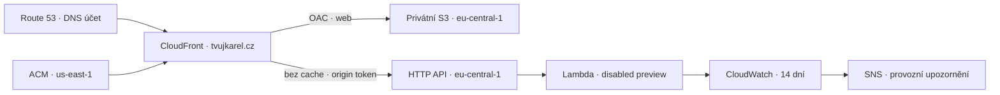

# Produkční hosting Tvůj Karel

Nasazený release na [tvujkarel.cz](https://tvujkarel.cz) je **veřejně dostupný neindexovaný náhled**. Skutečné ověření je v [dokladu nasazení](verification/deployment.md). Formulář vrací `503 PREVIEW_DISABLED`; žádný e-mail se neodesílá. Kontaktní údaje a schválení pro plné spuštění se nedoplňují odhadem. Produkční build gate zůstává zachovaný.

Během dobíhání DNS cache lze český náhled otevřít přímo na [CloudFront adrese](https://dr0yt09z2gh0y.cloudfront.net/cs/); ostatní jazyky mají cesty `/en/` a `/ru/`. Přímá adresa byla ověřená přes HTTPS s odpovědí 200. Přesměrování kořene a `www` nadále míří na hlavní doménu.

## Stack

| Vrstva           | Implementace                                                                                                                                            |
| ---------------- | ------------------------------------------------------------------------------------------------------------------------------------------------------- |
| Web              | Astro + TypeScript, jeden statický build pro `cs`, `en`, `ru`; lokální fonty a obrázky                                                                  |
| Účet pro hosting | `tvujkarel-prod`, `541855874226`, region `eu-central-1`                                                                                                 |
| Statické soubory | Privátní šifrované S3, Block Public Access, OAC pro konkrétní CloudFront distribuci, verzování; bucket při odstranění stacku zůstává                    |
| CDN              | CloudFront pay-as-you-go, PriceClass 100, HTTPS, TLS minimálně 1.2                                                                                      |
| Certifikát       | ACM v `us-east-1` pro apex i `www`; DNS validace v samostatném DNS účtu                                                                                 |
| Routing          | CloudFront Function: `www` → apex, `/` → `/cs/`, trailing slash a mapování na `index.html`; zachování query parametrů                                   |
| 404              | Neznámé stránky vrací přímo lokalizovanou HTML 404 z edge funkce; chybějící assety vrací 404 přes `/404.html`, bez SPA fallbacku                        |
| Formulář         | `/api/*` → API Gateway HTTP API → Node.js 22 ARM64 Lambda, bez cache; pouze `POST /api/contact`                                                         |
| Ochrany API      | API throttle 2 req/s, burst 5; validace, honeypot, omezení velikosti a per-process rate limiter; vlastní origin token odmítá přímé požadavky na API     |
| Adresa klienta   | Edge funkce přepisuje klientskou IP; Lambda jí důvěřuje až po ověření origin tokenu. Není použita společná IP CloudFront uzlu jako identita návštěvníka |
| E-mail           | Náhled: `CONTACT_MODE=disabled`, role bez SES oprávnění. SES přístup je v sandboxu; doménové ověření a skutečné doručení patří k následnému spuštění    |
| DNS účet         | `tvujkarel-dns`, `890192513455`; existující zóna `Z076204315B86GU4PJHXB`                                                                                |
| DNS změny        | ACM validační CNAME + A/AAAA aliasy apexu a `www` na CloudFront. Beze změny NS, registrace a dalších původních záznamů                                  |
| Logy             | Lambda a API Gateway, 14 dní; API log obsahuje pouze request ID, status, route a latenci; neloguje tělo, kontakty ani IP                                |
| Monitoring       | Lambda Errors/Throttles → SNS email; API 5xx alarm má v náhledu vypnuté akce kvůli očekávaným 503; odběr musí příjemce potvrdit                         |
| Náklady          | AWS Budget pro produkční účet s emaily při 80 % a 100 % skutečných měsíčních nákladů; DNS je v jiném účtu                                               |
| CI               | GitHub Actions přes OIDC pouze `lukasniedoba/tvujkarel`, environment `production`; workflow je manuální a omezený na `main`                             |
| Rollback         | Uchovaný CDK cloud assembly obsahuje konkrétní statický build a balíček Lambdy; opětovné nasazení obnoví celek a invaliduje CDN                         |

Nový produkční účet má ověřenou Lambda concurrency kvótu **10**. Rezervovaná concurrency proto není nastavená: AWS vyžaduje alespoň 100 volných nerezervovaných běhů. API throttling ani měsíční Budget nejsou pevný finanční strop. Limiter Lambdy není sdílený mezi instancemi.



## Náklady a hranice

Orientační provozní odhad pro malý náhled je **1–3 USD měsíčně**, nikoli cenová garance. Předpoklad: statický build kolem 2 MB, nízká návštěvnost, několik verzí/releasů, tři standardní alarmy a malý objem logů/API. Výsledek závisí na skutečné návštěvnosti, způsobilosti účtu/Organization pro Free Tier a využití sdílených limitů. CloudFront je v pay-as-you-go režimu podle zadání. Návrh Budget je **5 USD/měsíc**, musí být schválený před vytvořením účtovaných prostředků.

Samostatně existuje Route 53 DNS zóna a roční obnova domény; návrh Budget v prod účtu je nezahrnuje. CDK bootstrap ukládá deploy assety do samostatného privátního bucketu. Logy, metriky, build assety, invalidace a přenosy jsou účtované podle spotřeby. Veřejný neexportovatelný ACM certifikát pro CloudFront nemá poplatek za samotný certifikát. Náhled nevytváří NAT Gateway, databázi, EC2 ani placený WAF.

Aktuální zdroje cen ověřené 10. 10. 2026: [CloudFront pay-as-you-go](https://aws.amazon.com/cloudfront/pricing/pay-as-you-go/), [S3](https://aws.amazon.com/s3/pricing/), [API Gateway](https://aws.amazon.com/api-gateway/pricing/), [Lambda](https://aws.amazon.com/lambda/pricing/), [CloudWatch](https://aws.amazon.com/cloudwatch/pricing/), [Route 53](https://aws.amazon.com/route53/pricing/), [ACM](https://aws.amazon.com/certificate-manager/pricing/), [AWS Budgets](https://aws.amazon.com/aws-cost-management/aws-budgets/pricing/). Odhad je založený na rozsahu tohoto stacku, nejde o nabídku AWS.

## První nasazení

1. Přihlásit oba SSO profily a ověřit account IDs.
2. Spustit `npm ci`, `npm run check`, `npm test`, `npm run build`, `npm run infra:synth`. Offline synth používá pouze syntetický certificate ARN; ten se nikdy nesmí použít pro deploy.
3. Po schválení rozpočtu vytvořit ignorovaný `.deployment/config.json`:

   ```json
   { "alertEmail": "SKUTECNY_OPERATOR_EMAIL", "monthlyBudgetUsd": 5 }
   ```

4. `npm run deploy:certificate` požádá ACM o certifikát v hosting účtu a přidá jeho validační CNAME do DNS účtu. Existující konfliktní hodnotu nepřepíše. Počkat na ACM `ISSUED`.
5. Bootstrap pouze hosting účtu ve Frankfurtu:

   ```sh
   AWS_PROFILE=administrator-tvujkarel-prod npx cdk bootstrap aws://541855874226/eu-central-1
   ```

   CDK bootstrap vytváří vlastní S3/ECR a deployment role. Standardní CloudFormation execution role má v tomto vyhrazeném účtu administrátorská oprávnění; CI umí tyto deployment role převzít. Přístup k workflow environmentu proto musí být omezený na důvěryhodné správce a chráněnou větev `main`.

6. `npm run deploy:preview -- --apply` kontroluje obě identity a ACM, vynutí preview režim, sestaví web a Lambdu, uchová cloud assembly, ukáže diff, nasadí hosting a následně asset-free DNS stack přes CloudFormation v DNS účtu. DNS účet nepotřebuje CDK bootstrap; jeho šablona používá BootstraplessSynthesizer. Potom ověří živé HTTPS, routing a vypnutý formulář.
7. Potvrdit SNS subscription ve skutečné schránce. AWS Budget emaily jsou samostatné. Případné čekání DNS zopakovat `npm run deploy:verify`. Při staré lokální delegaci použít `npm run deploy:verify -- --public-dns`; zachová TLS ověření a použije veřejné rekurzivní DNS.

Origin token se vytváří lokálně do `.deployment/origin-token` s právy `0600`. Nejde do klientského buildu ani Gitu. CloudFormation parametr je `NoEcho`; správci AWS mohou číst konfiguraci CloudFront/Lambda, proto token není náhradou IAM. `.deployment/` obsahuje provozní konfiguraci a nemá být zveřejněná.

## CI aktivace

Při prvním nasazení byla odhalená stará CloudFront distribuce v původním účtu `005908799433`, která stále držela alias `tvujkarel.cz`, přestože její S3 origin už neexistoval. Z distribuce `EXFJNR3B9B9BI` byl uvolněný pouze tento alias; ostatní distribuce a původní DNS zóna zůstaly beze změny. První neúspěšný stack se vrátil do `ROLLBACK_COMPLETE`; jeho prázdný bucket a loggroups byly ověřené a uklizené před opakováním deploy. Kvůli resolverům s původní NS delegací byla do staré DNS zóny doplněná shodná A/AAAA aliasová webová DNS záznamy na novou distribuci. Úklid zóny zůstává až po 12. 10. 2026 18:15 CEST a novém ověření delegace. Původní CloudFront konfigurace je uložená lokálně v `.deployment/legacy-distribution-before.json`.

IAM OIDC role i GitHub environment `production` jsou vytvořené. Po výslovném schválení uživatelem bylo přes API ověřené omezení pouze na větev `main` a povinný reviewer `lukasniedoba`. Variables `CERTIFICATE_ARN`, `MONTHLY_BUDGET_USD=5` a secrets `ALERT_EMAIL`, `CONTACT_ORIGIN_TOKEN` odpovídají prvnímu release. Vlastník může schválit i vlastní spuštění; tato volba umožňuje provoz s jediným správcem. Workflow `.github/workflows/deploy-preview.yml` se spouští manuálně přes GitHub Actions; samotný push deploy nespustí. První běh CI zatím neproběhl. Další releasy nasazuje do hosting účtu a nemá přístup k DNS účtu. Cloud assembly a ověření uchovává 30 dní jako artifact.

## Rollback

Vybrat **konkrétní předchozí** `.deployment/releases/<release>/cdk.out` nebo stažený a rozbalený CI artifact. Nesmí se před tím znovu spouštět synth/build. S AWS profilem hosting účtu spustit:

```sh
AWS_PROFILE=administrator-tvujkarel-prod npx cdk diff TvujKarelHosting --app .deployment/releases/<release>/cdk.out --no-change-set
AWS_PROFILE=administrator-tvujkarel-prod npx cdk deploy TvujKarelHosting --app .deployment/releases/<release>/cdk.out
npm run deploy:verify
```

Pro existující stack CDK zachová předchozí hodnoty parametrů, pokud nejsou nové hodnoty výslovně předané. Assety z assembly obnoví web i Lambda kód; `BucketDeployment` vytvoří invalidaci `/*`. U prvního release zatím neexistuje předchozí funkční release. Automatické odstranění stacků ani bucketu není rollback. Ověřit konečný CloudFormation stav, CloudFront `Deployed` a živé smoke checks. Postup je připravený; rollback lze označit za otestovaný až po skutečném návratu.

## Přechod na plnou produkci

Doplnit pravdivé veřejné kontakty a soukromí, schválit texty/překlady/obrázky, nastavit skutečné uchování, SES identity/DKIM a potvrdit doručení do cílové schránky. Před odesláním testovacího emailu vyžádat samostatné konkrétní zadání. Následně upravit CDK serverovou konfiguraci a úzká SES oprávnění, odstranit preview `X-Robots-Tag`, zapnout akce API 5xx alarmu, sestavit přes `build:production` a provést živou akceptaci včetně cyrilice. DNS a certifikát zůstávají společné. Stávající workflow je výslovně pro preview a plnou produkci sám nezapne.
