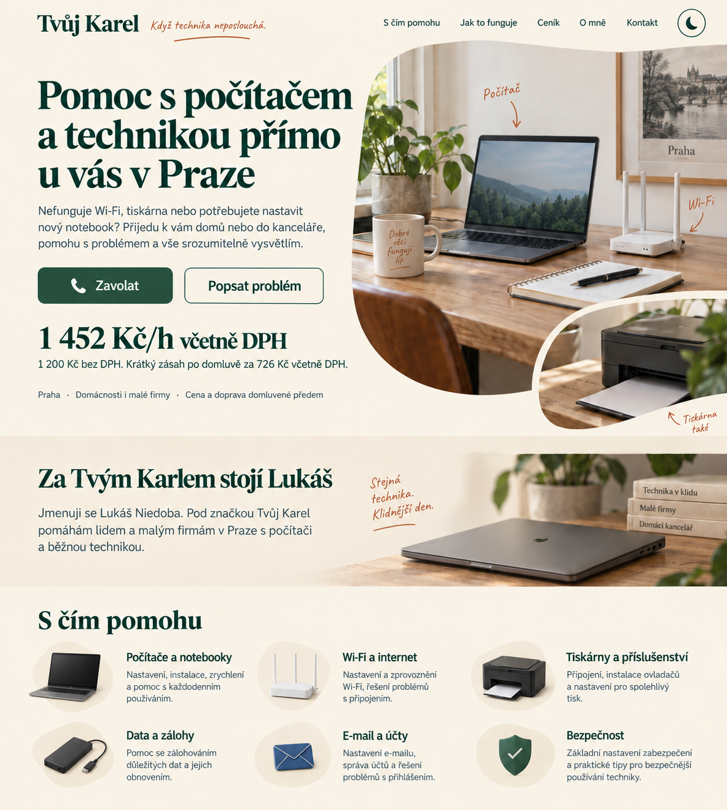
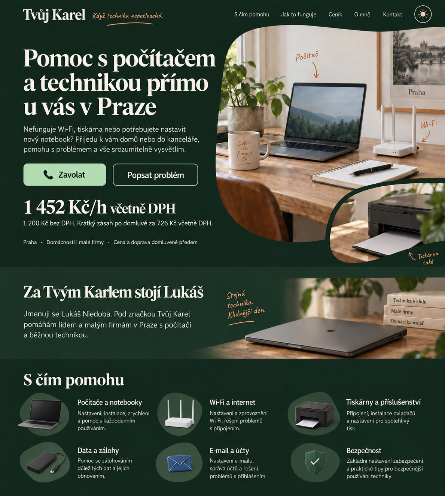

# Referenční vizuál Tvůj Karel

Schválený vizuální směr: **Organic Editorial**, světlý a tmavý režim.
Schváleno 7. 10. 2026. Funkční rozsah a obsah webu určuje [zadání webu](../../TvujKarel_zadani_webu.md).

## Světlý režim

Krémové pozadí, lesní zelená, terakotové ruční poznámky a teplé fotografie techniky.
Ikona měsíce vpravo v hlavičce představuje přepnutí do tmavého režimu.

## Tmavý režim

Hluboké zelené pozadí, teplý světlý text a šalvějové hlavní tlačítko.
Ikona slunce vpravo v hlavičce představuje přepnutí do světlého režimu.

## Pokyny pro implementaci

- Zachovat rozložení, typografii, organické výřezy fotografií a osobní tón vybraného návrhu.
- Oba režimy mají stejné rozložení, obsah a fotografie; mění se barvy rozhraní a ikona přepínače.
- Zachovat výraznou cenu a hlavní akci **Zavolat** v úvodu.
- Služby zobrazovat jako přehledné položky na společné ploše, bez samostatných velkých karet.
- Typografický směr: Fraunces pro výrazné nadpisy a Manrope pro běžný text a ovládací prvky.
- První verze webu obsahuje češtinu, angličtinu a ruštinu včetně přepínače **Čeština / English / Русский**. České texty v referenčních obrázcích jsou výchozí verzí; rozložení musí pojmout delší překlady v obou režimech.
- U použitých fontů a řezů ověřit českou diakritiku i cyrilici; pro ruštinu případně zvolit odpovídající font, který zachová typografický styl návrhu.
- Při implementaci ověřit kontrast, ovládání klávesnicí a mobilní rozložení v obou režimech.

PNG soubory jsou schválené návrhy vytvořené pomocí ImageGen. Slouží jako vizuální reference; veřejné texty a rozsah služeb mají odpovídat zadání webu.
