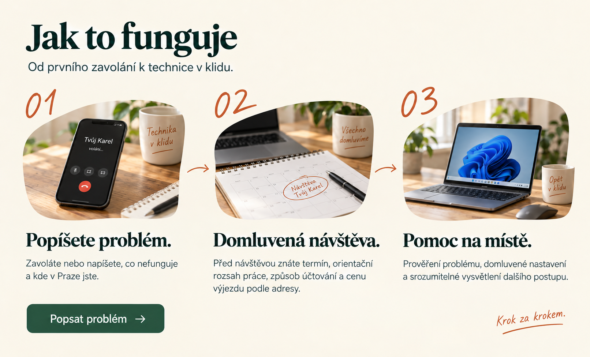
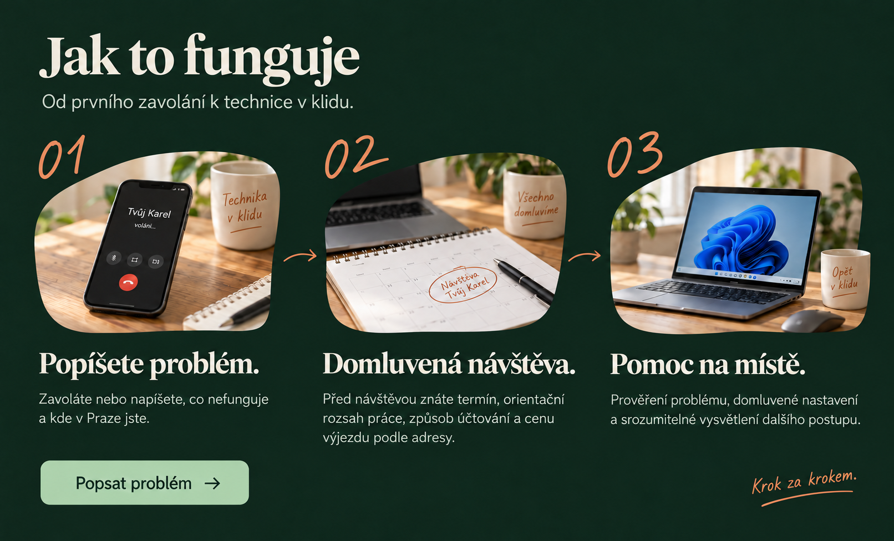
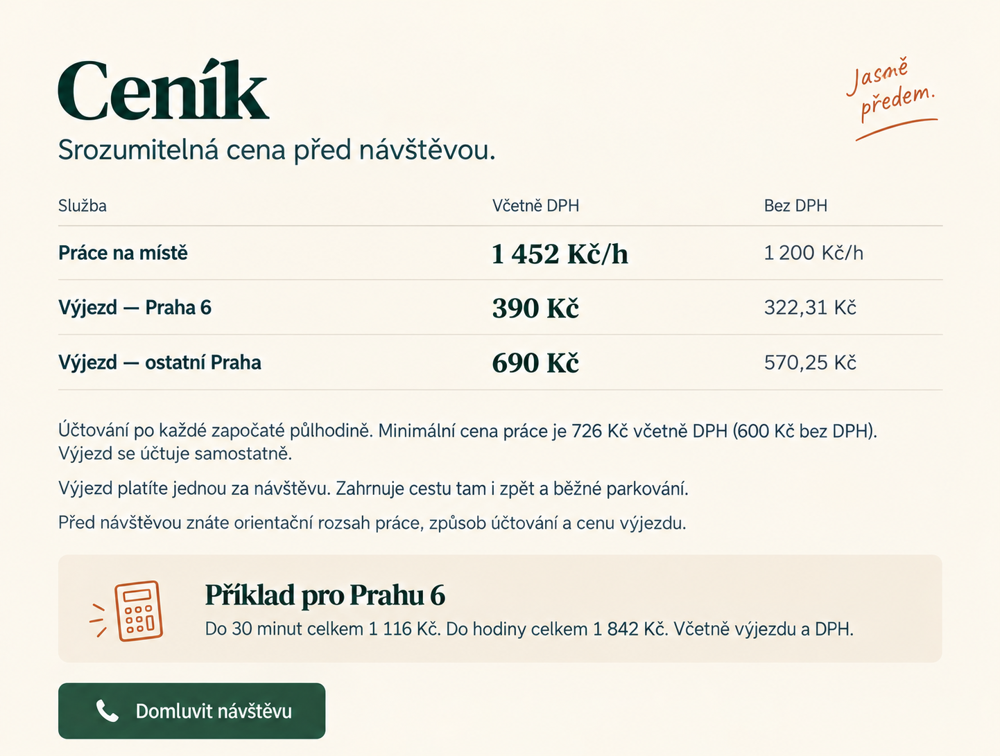
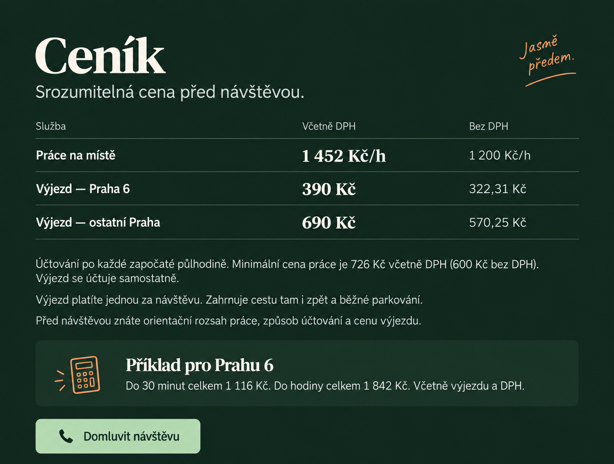
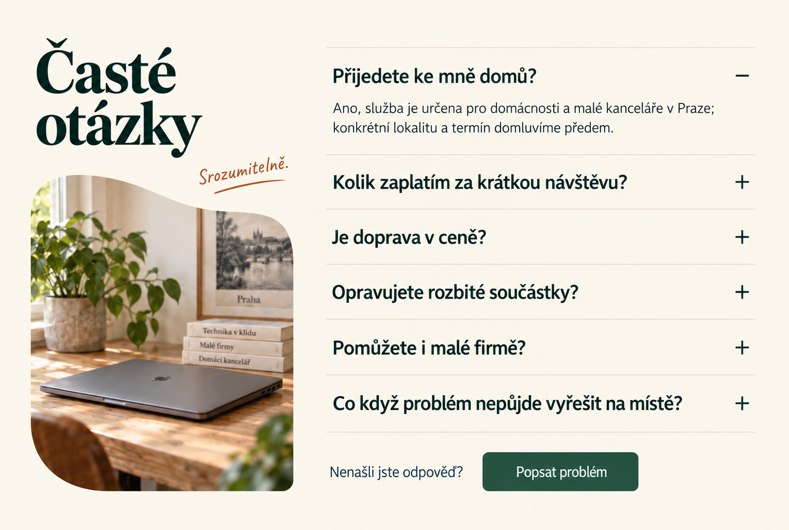
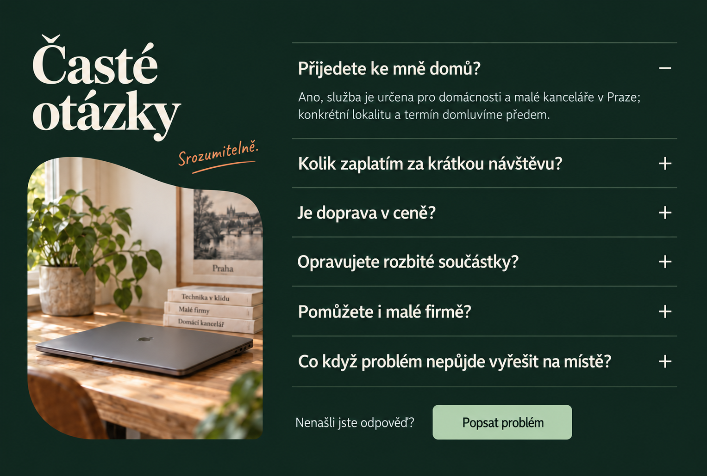
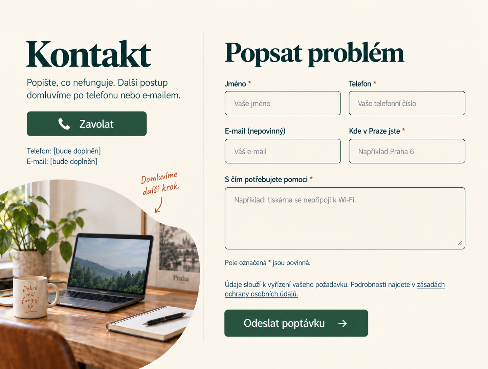
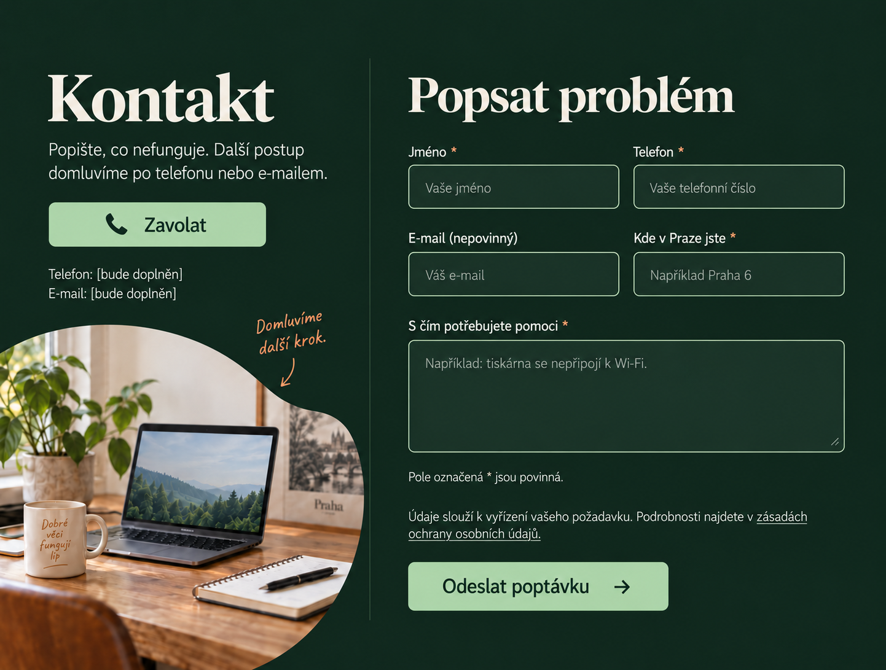
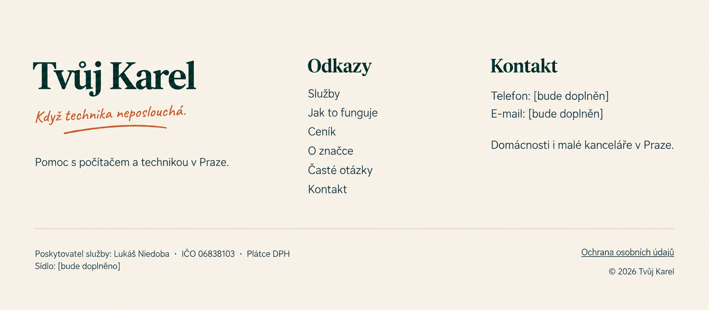
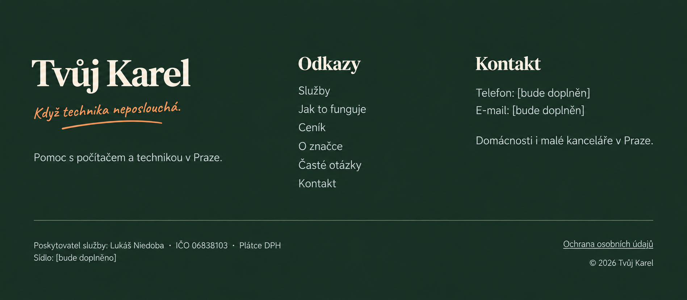

# Další sekce webu Tvůj Karel

Vytvořeno 9. 10. 2026 vestavěným ImageGen jako pokračování vybraného směru **Organic Editorial**. Jde o referenční návrhy pro posouzení a implementaci. Každá sekce má světlou a tmavou verzi; nejde o alternativní návrhy k výběru.

Navazují na [úvod, blok o značce a služby](README.md). Pořadí hlavní stránky: úvod → o značce → služby → postup → ceník → FAQ → kontakt → patička. Obsah, překlady a funkční požadavky určuje [zadání webu](../../TvujKarel_zadani_webu.md).

Náhledy jsou v češtině. Telefon, e-mail a sídlo označené `[bude doplněn]` či `[bude doplněno]` jsou placeholdery; před spuštěním je nahradit skutečnými údaji. Přepínač jazyků zůstává v hlavičce podle zadání.

## Jak to funguje

Tři kroky návštěvy na společné ploše s organickými výřezy fotografií. Tlačítko **Popsat problém** vede na kontakt.

### Světlý režim

### Tmavý režim

## Ceník

Jedna hodinová sazba a dva paušály za výjezd. Částky včetně DPH jsou hlavní; pod tabulkou je půlhodinové minimum a příklad celkové ceny pro Prahu 6.

### Světlý režim

### Tmavý režim

## Časté otázky

Rozbalovací seznam všech šesti otázek. Návrh ukazuje první odpověď otevřenou a ostatní zavřené; úplné odpovědi určuje zadání webu. Při implementaci zajistit ovládání klávesnicí a správné oznámení rozbaleného stavu.

### Světlý režim

### Tmavý režim

## Kontakt a formulář

Přímé volání a formulář s pěti poli. E-mail je nepovinný. Návrh zachycuje prázdný formulář; validace a výsledkové stavy se řídí zadáním.

### Světlý režim

### Tmavý režim

## Patička

Značka, odkazy, kontakt a oddělené identifikační údaje poskytovatele. Chybějící kontakty a sídlo jsou zřetelně označené k doplnění.

### Světlý režim

### Tmavý režim

## Předání do implementace

Všechny výřezy skládat jako sekce jednoho webu. Zachovat jednotný kontejner, škálu typografie a rozestupy podle úvodního návrhu; jednotlivé PNG mají přirozené poměry stran a nejsou hotovou responzivní implementací. Změna barevného režimu nemění obsah ani fotografie. Ceny ponechat v Ceníku, osobní medailonek nenavracet.

Před implementací ověřit finální texty, kontakt a sídlo. Při implementaci ověřit mobilní rozložení, delší překlady, kontrast, focus a formulářové stavy. [Přesné prompty](section-prompts.md) jsou uložené pro dohledatelnost.
